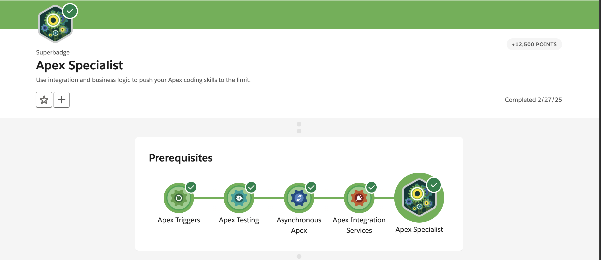
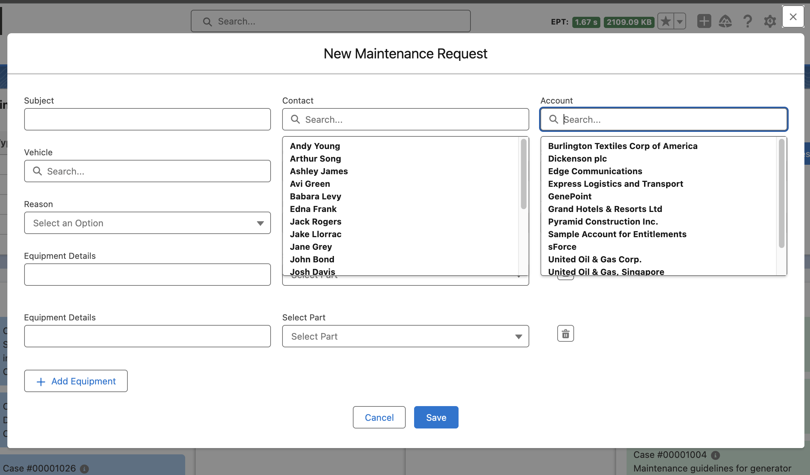

# 🚐 Apex Specialist Superbadge Project

This project is built as a solution to the **Salesforce Apex Specialist Superbadge**, showcasing advanced Apex development skills, integration, and automation techniques.

---

## 📖 Use Case

**HowWeRoll Rentals**, the world’s largest RV rental company, offers top-tier RV rental and roadside assistance services. With their fleet growing exponentially, they need scalable solutions to manage routine and emergency maintenance for vehicles.

As the **Salesforce Developer**, your task is to:

- Automate service workflows
- Flag unsafe or unmaintained vehicles
- Sync Salesforce with a back-office inventory system
- Help the RV repair team manage and prioritize cases efficiently

---

## 🧩 Task required to Earn This Superbadge

✔️ Automate record creation using Apex triggers  
✔️ Synchronize Salesforce data with an external system using asynchronous REST callouts  
✔️ Schedule synchronization using Apex code  
✔️ Test automation logic to confirm Apex trigger side effects  
✔️ Test integration logic using callout mocks  
✔️ Test scheduling logic to confirm actions get queued

---

## 🧪 Concepts Tested in This Superbadge

- **Apex Triggers**
- **Asynchronous Apex** (`@future`, `Queueable`)
- **Apex Integration** (`HttpCallout`, `Named Credentials`)
- **Apex Testing** (Mocks, DML side effects, coverage)
- **Apex Scheduler**

---

## 🖥️ LWC component (not a part of Super Badge but added to developed UI along with backend functionality)

To complement the Apex automation, an **LWC dashboard** was implemented to enhance user experience with the following features:

### 🔹 Drag-and-Drop Case Management
Easily update the status of cases using a visual drag-and-drop interface.

### 🔹 Hover-to-View Product Details
Hovering over a case card reveals associated product(s) in a quick tooltip.

### 🔹 Case Status Summary Table
Displays a live count of cases grouped by status for fast insights.

### 🔹 Case Creation Form
Create new maintenance requests and associate multiple products through a guided form.

---

## 🧰 Technologies Used

- Apex Classes, Triggers, and Test Classes
- Queueable & Future Apex
- Named Credentials & HttpCallouts
- Lightning Web Components (LWC)
- SOQL & DML Operations
- Custom Metadata Types
- Git for Version Control

---

